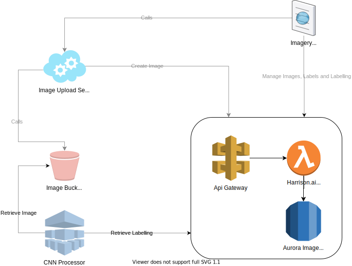

# Harrison.AI Imagery API Design

The intent for the design is to streamlining the software development cycle with CI/CD to ensure maximum service availabiliity, and horizontal scalability.

## Overall Architecture

Harrison.AI Imagery API employs the `serverless` architecture. Under the hood it is designed to deploy to `AWS API Gateway` and `AWS Lambda`. The round-cornered square in the above diagram is the boundary of Imagery API and its relations to other components in the Harrison.AI eco-system.

The `serverless` architecture uses a `serverless.yml` file to manage immutable infrastructure. It was designed to ensure on-demand scalability, cost-efficiency and robustness.

Please be aware that image storage is managed by a seperate service (the `Image Upload Service`), uploaded into an `AWS S3 Bucket` and exposed through `S3 Static Website`. How it works is outside the scope of this document.

Once images are uploaded, a subsequent call to Imagery API is made to create images record in the database. The user is then able to manage labellings through the `Imagery UI`.

The CNN Processor runs asynchronously to train disease classification model based on Imagery Labelling provided by the Imagery API. The invocation can either be done by a `AWS Cloudwatch Alarm`, or `AWS SQS`

## Database

Harrison.AI Imagery API is designed to work with `AWS Aurora 2 (MySQL 5.7)` database.

### Entity Relational Diagram

In local environment the database runs in a `Docker` container with `MySQL 5.7` image. Rebuilding the docker image will lose all custom data.

## Codebase

Imagery API is implemented with Typescript and Express.js. The main architecture of code base is heavly inspired by the [`Clean Architecture`](https://blog.cleancoder.com/uncle-bob/2012/08/13/the-clean-architecture.html) for better separation of concerns and simple substitution of Database layer and http layer in the future.

GraphQL could also be a great alternative for REST however since most of the API functions are CRUD we won't take too much advantage by using GraphQL as its main strength is in the Queries space.

## Authentication

The Imagery API employs API Key Authentication. The key issuing is currently mocked and in the real world should be managed by a seperate service, ideally by a mature cloud product such as `Auth0` and stored into another secured storage.

When the local database server starts, the api key `3fbc8c169a574a11a8b4697809419a1c` is automatically issued for userId `1` and will last for 8 hours. The key will need to be extended manually after expiry.

## Deployment

For simplicity the project does not provide auto-deployment. However ideally we should at least have three cloud environments to deploy despite of the local environment, after build and tests.

- Dev environment

  Any development work commited to dev branches should automatically be deployed to one shared dev environment, or multiple dev environments depending on the team size (to reduce deployment conflicts). Dev environment is for development testing and possibly QA testing.

- Staging environment

  Any commit to master branch should be automatically deployed to staging environment. This is the environment to run integration tests, and to test integration with sibling Harrison.AI components.

- Production environment

  Upon completion of integration tests in Staging environment, the developer can choose to release the master branch to Production environment.

  In order to avoid downtimes, we could use `Canary deployment` which is supported by the `Serverless` framework. Under the hood it deploys the newer version of the Imagery API to `AWS Lambda`, and then does a `Traffic Shift` from the older version to the newer version.

  Depending on the requirements, we can choose the shifting strategy between `Canary` (specific amount of traffic shifts in an interval, then all traffic shifts), `Linear` (specific traffic portion shifts over each interval, until all traffic shifted), or `All-at-once` (all traffic shifts at once).

  To read more about `Canary deployment` in `Serverless`, read [here](https://www.serverless.com/blog/manage-canary-deployments-lambda-functions-serverless-framework).

## Logging, Dashboarding and Analytics

Errors and API traffics are logged into console, which should both logged into `AWS Cloudwatch` logs, with PII data removed after deploy to `AWS Lambda`. The logs should then be harvested into `Datadog` or `Splunk` for analytics or monitoring.
